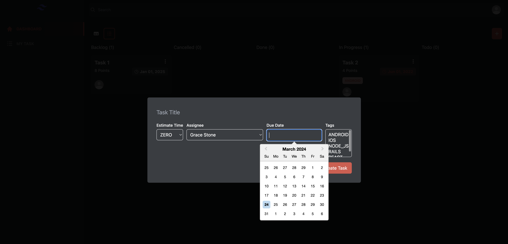

# Task Management App

## Setup and Running Instructions

### Prerequisites

Before running the project, make sure you have Node.js and npm installed on your machine.

- [Node.js](https://nodejs.org/)
- [npm](https://www.npmjs.com/)

### Installation

1. Clone the repository:

   ```bash
   git clone https://github.com/AlfaroLore/task-management-app.git
   ```

2. Navigate to the project directory:

   ```bash
   cd task-management-app
   ```

3. Install the dependencies:

   ```bash
   npm install
   ```

### Running the Project

To run the project locally, use the following command:

```bash
npm run dev
```

Open [http://localhost:5173/](http://localhost:5173/) in your browser to view the project.

### Building the Project

To build the project for production, use the following command:

```bash
npm run build
```

### Running Tests

To run the tests, use the following command:

```bash
npm run test
```

## Project description

This project is a task management application inspired by Trello, designed to help users organize and manage their tasks effectively. It provides a user-friendly interface for creating, editing, and tracking tasks, along with features such as task prioritization, due date tracking, and task assignment.

## Stack

This project was bootstrapped with [Vite](https://vitejs.dev/) + [React](https://reactjs.org/) + [TypeScript](https://www.typescriptlang.org/).

## Why TypeScript?

TypeScript was chosen for this project due to its ability to handle the contract with the backend types more effectively. By using TypeScript, we can ensure a stronger and more robust connection between the frontend and backend, reducing the likelihood of runtime errors and improving the overall development experience.

## ESLint Configuration

The project is configured with [ESLint](https://eslint.org/) using the [Airbnb style guide](https://github.com/airbnb/javascript) to maintain a consistent coding style and catch potential issues early in the development process.

## Testing with ViteTest

[ViteTest](https://github.com/alexjoverm/vitest) is used for testing the project. It is a testing utility built specifically for Vite projects, making it easier to write and run tests. Unfourtunately there's only one test.

## Styling with Tailwind CSS

[Tailwind CSS](https://tailwindcss.com/) was chosen for styling the project. Tailwind provides a utility-first CSS framework that allows you to easily add classes without worrying if it is already defined in your CSS files. This approach offers a more flexible and maintainable way to style components.

## Components

### Heroicons

Heroicons were used for adding beautiful and customizable icons to the project. Heroicons provides a set of free, open-source icons crafted specifically for web and application projects.

### Headless UI

Headless UI components were utilized to build accessible and reusable UI components. Headless UI provides fully accessible, highly customizable, and framework-agnostic UI components that can be used to build custom UIs.

## Components Folder Structure

The components folder structure follows the [Atomic Design](https://atomicdesign.bradfrost.com/) methodology. This design system allows for a more systematic and scalable approach to building UI components, making it easier to manage and maintain the project as it grows.

## Screenshots




## Additional Information

A Trello dashboard was used to track the progress of the project:
[Dashboard](https://trello.com/b/RZ9UN84n/react-challenge-todo-list)
